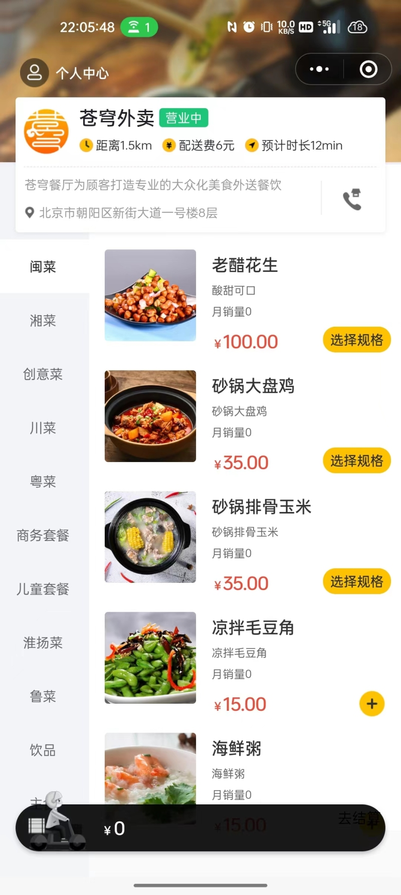
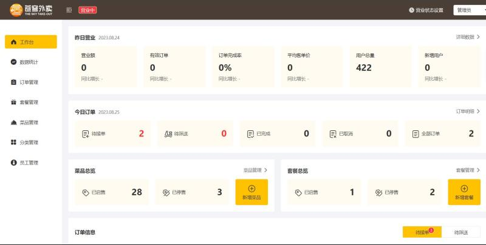

# Project Introduction
## Takeout Food Management Application
This project is a takeout management system utilizing a front-end and back-end separation architecture with Spring Boot, MyBatis Plus, and MySQL.

## Tech Stacks

- SpringBoot (3.1.2)
- Spring Security
- Spring MVC
- Mybatis
- MySql
- Redis
- RESTful API
- Lombok
- Maven
- Junit

## Frontend Review


## Backend Review


## Setting Up Development Environment 
1. Install Java JDK 17 and Configure Environment Variables.
2. Install MySQL and Redis Databases and Create Corresponding Databases.

   - Create MySQL database and tables by running mysql.sql.[mysql.sql](./demo/mysql.sql)

3. Install Maven Build Tool.
4. Download and Install Nginx, and Complete the Following Configuration:

   ```
   # Add the following configuration under the 'http' section

   map $http_upgrade $connection_upgrade{
   	default upgrade;
   	'' close;
   }

   upstream webservers{
     server 127.0.0.1:8080 weight=90 ;
     #server 127.0.0.1:8088 weight=10 ;
   }

   server {
       listen       80;
       server_name  localhost;

       location / {
           root   html/sky;
           index  index.html index.htm;
       }

       # Reverse proxy to handle requests from the admin side
       location /api/ {
   		proxy_pass   http://localhost:8080/admin/;
           #proxy_pass   http://webservers/admin/;
       }

   	# Reverse proxy to handle requests from the user side
       location /user/ {
           proxy_pass   http://webservers/user/;
       }

   	# WebSocket
   	location /ws/ {
           proxy_pass   http://webservers/ws/;
   		proxy_http_version 1.1;
   		proxy_read_timeout 3600s;
   		proxy_set_header Upgrade $http_upgrade;
   		proxy_set_header Connection "$connection_upgrade";
       }

       location /media {
          root Configure media file location; e.g., D:/static
          # Note: Create a media folder under D:/static
       }
   }
   ```

5. Clone the Project to Local Machine.
6. Modify Configuration Files: [application.yml](./sky-server/src/main/resources/application.yml)

   ```yml
   spring:
     datasource:
       url: jdbc:mysql://url
       username: root
       password: Database password
     data:
       redis:
         password: Redis database password
   ```

7. Create application-env.yml File in the resources Directory with the Following Configuration.

   ```yml
   sky:
     wechat:
       appid: 
       secret: 
       mchid: 
       mchSerialNo:
       privateKeyFilePath:
       apiV3Key:
       weChatPayCertFilePath:
       notifyUrl:
       refundNotifyUrl:
   ```

8. Run it.
# Takeout-Food-Application
